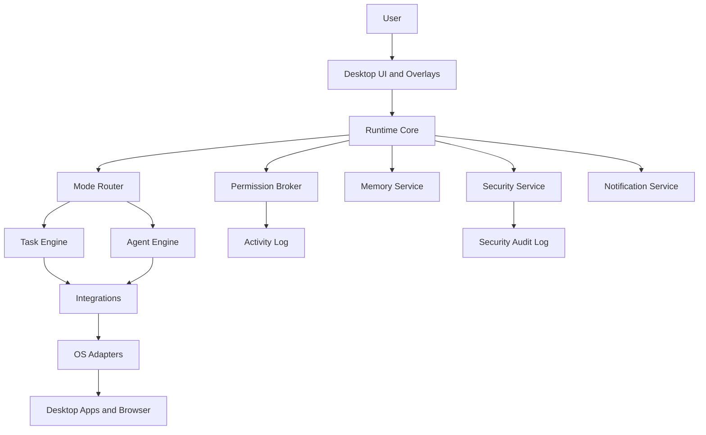
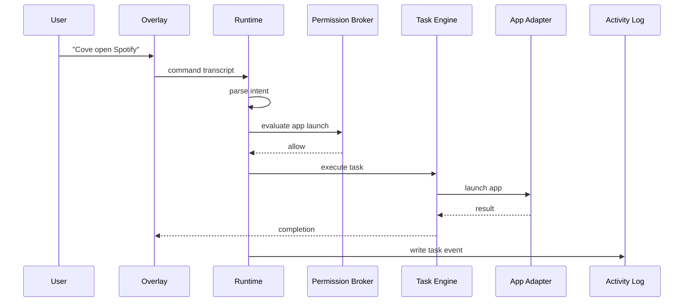
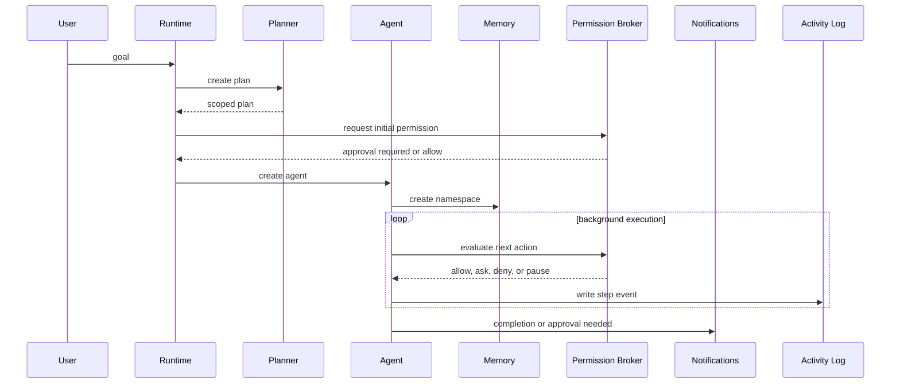
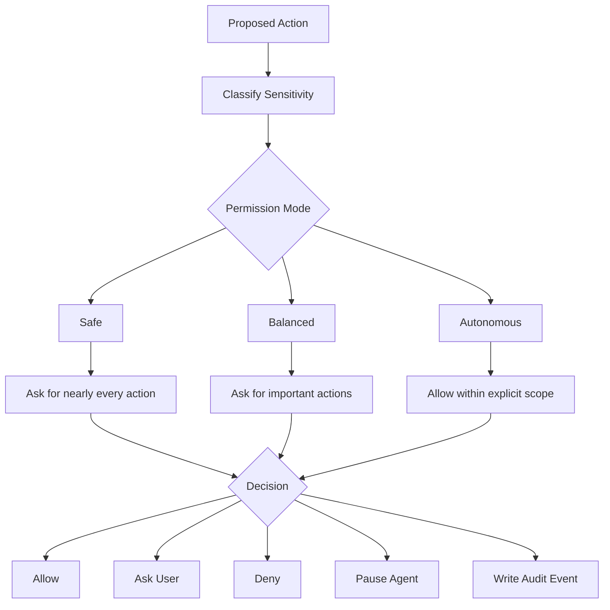
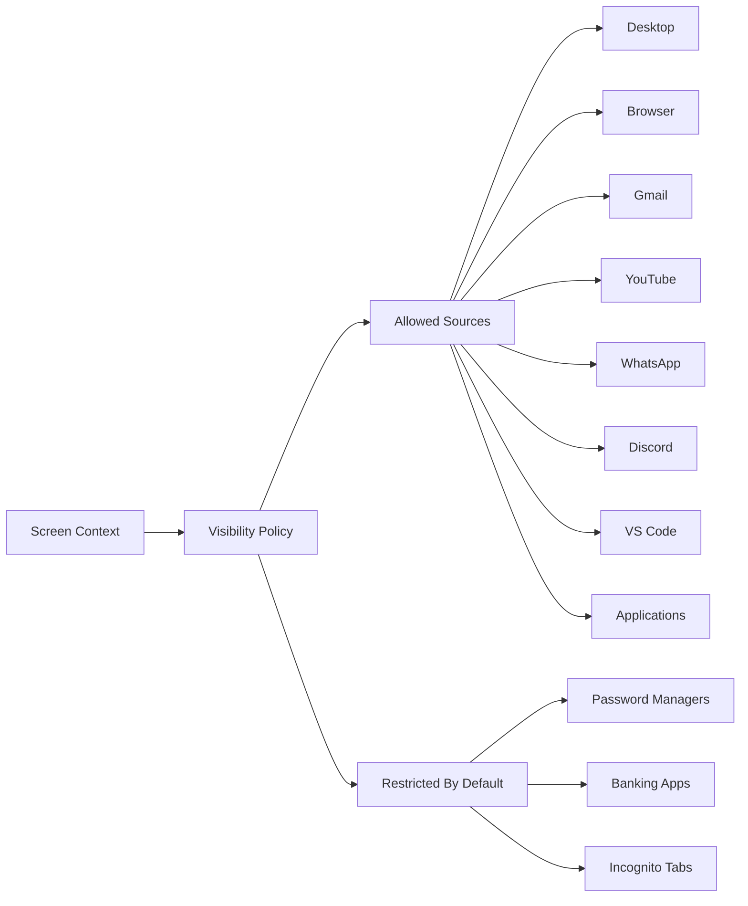
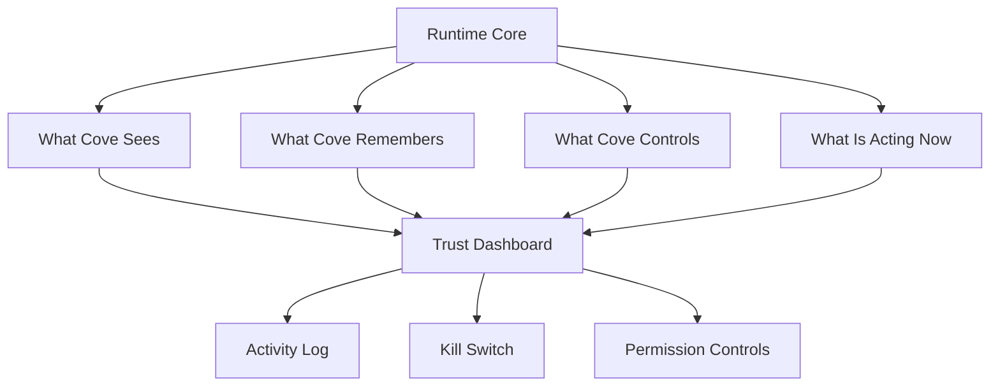

# Architecture Diagrams

Status: architecture specification only. Diagrams use Mermaid so they can render in Markdown viewers that support it.

## High-Level Runtime

## Task Mode Flow

## Agent Mode Flow

## Permission Decision

## Screen Understanding Boundary

## Trust Surface

